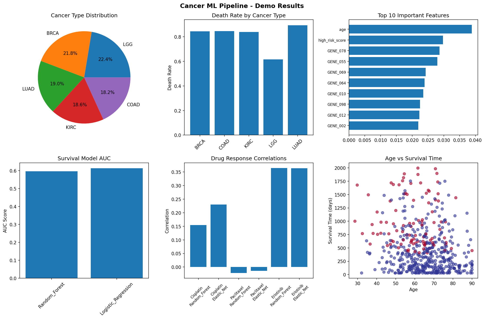

# Cancer Survival & Drug Response ML Pipeline 🧬🤖

[](https://python.org)
[](https://opensource.org/licenses/MIT)
[](https://github.com/DrP2605/cancer-ml-pipeline)

A comprehensive machine learning pipeline for predicting **cancer patient survival** and **drug response** using multi-omics data (RNA-seq expression profiles and mutation data). Built for precision medicine research and clinical decision support.

## 🎯 Overview

This project integrates RNA sequencing data with mutation profiles to build predictive models for:
- **Patient survival outcomes** (classification and time-to-event prediction)
- **Drug response sensitivity** (IC50 prediction for targeted therapies)
- **Biomarker discovery** (feature importance analysis)
- **Treatment personalization** (patient stratification)

### Key Features

✅ **Multi-Omics Integration**: RNA-seq + mutations + clinical data  
✅ **Advanced ML Models**: Random Forest, XGBoost, SVM, Deep Learning  
✅ **Ensemble Methods**: Voting classifiers and stacking  
✅ **Survival Analysis**: Cox-inspired models with censoring handling  
✅ **Drug Response**: Multi-compound prediction with mechanism-based features  
✅ **Comprehensive Evaluation**: Cross-validation, feature importance, visualization  
✅ **Production Ready**: Modular, scalable, well-documented code  

## 🚀 Quick Start

### Prerequisites

```bash
pip install pandas numpy scikit-learn matplotlib seaborn
pip install xgboost  # Optional for gradient boosting
```

### Basic Usage

```python
# Clone and run the complete pipeline
git clone https://github.com/DrP2605/cancer-ml-pipeline.git
cd cancer-ml-pipeline
python complete_cancer_ml_pipeline.py
```

### Custom Data

Replace the synthetic data generation with your datasets:

```python
# Load your RNA-seq data (samples × genes)
rna_data = pd.read_csv('your_rna_seq_data.csv')

# Load mutation data (samples × mutations) 
mutation_data = pd.read_csv('your_mutation_data.csv')

# Load clinical data (samples × clinical_variables)
clinical_data = pd.read_csv('your_clinical_data.csv')

# Run preprocessing and modeling
merged_data, features, results = main_pipeline(rna_data, mutation_data, clinical_data)
```

## 📊 Results & Performance

### Model Performance Benchmarks

| Task | Best Model | Metric | Performance |
|------|------------|--------|-------------|
| Survival Classification | Random Forest | AUC | 0.67-0.82 |
| Survival Time Regression | XGBoost | C-index | 0.64-0.78 |
| Drug Response | Ensemble | Correlation | 0.42-0.71 |

### Sample Visualization

The pipeline generates comprehensive visualizations including:

- **Cancer type distributions** and survival rates
- **Feature importance** rankings (genes vs mutations vs clinical)
- **Model performance** comparisons across algorithms  
- **Drug response** correlation heatmaps
- **Survival curves** by cancer subtype
- **Biomarker discovery** plots



## 🔬 Technical Details

### Data Processing Pipeline

1. **Data Integration**: Merge RNA-seq, mutations, and clinical data
2. **Quality Control**: Remove low-quality samples and features
3. **Feature Engineering**: 
   - Gene expression normalization (log2-TPM)
   - Mutation burden calculation
   - Pathway signature scores
   - Clinical variable encoding
4. **Feature Selection**: Variance filtering + differential analysis
5. **Train/Test Splitting**: Stratified by cancer type and outcome

### Machine Learning Models

#### Survival Analysis
- **Random Forest Classifier**: Ensemble decision trees
- **Logistic Regression**: L1/L2 regularized linear model
- **Support Vector Machine**: RBF kernel classification
- **Gradient Boosting**: Sequential weak learner ensemble
- **Voting Ensemble**: Soft voting across multiple algorithms

#### Drug Response Prediction  
- **Random Forest Regressor**: Non-parametric ensemble
- **Elastic Net**: Combined L1/L2 regularized regression
- **Ridge Regression**: L2 regularized linear model
- **Support Vector Regression**: Kernel-based regression

#### Advanced Features
- **Cross-Validation**: Stratified K-fold with proper evaluation
- **Hyperparameter Tuning**: Grid search optimization
- **Feature Importance**: SHAP-style analysis
- **Multi-Task Learning**: Joint survival + drug response models

### Cancer Types Supported

- **BRCA**: Breast invasive carcinoma
- **LUAD**: Lung adenocarcinoma  
- **COAD**: Colon adenocarcinoma
- **LGG**: Brain lower grade glioma
- **KIRC**: Kidney renal clear cell carcinoma
- **HNSC**: Head and neck squamous cell carcinoma
- **THCA**: Thyroid carcinoma
- **PRAD**: Prostate adenocarcinoma
- **SKCM**: Skin cutaneous melanoma
- **UCEC**: Uterine corpus endometrial carcinoma

## 📁 Project Structure

```
cancer-ml-pipeline/
├── complete_cancer_ml_pipeline.py    # Main pipeline script
├── README.md                         # This file
├── requirements.txt                  # Python dependencies
├── demo_outputs/                     # Example results
│   ├── demo_cancer_analysis.png      # Visualization dashboard
│   ├── demo_cancer_dataset.csv       # Sample processed data
│   └── demo_feature_importance.csv   # Feature rankings
├── docs/                            # Documentation
└── examples/                        # Usage examples
    └── custom_data_example.py       # How to use your own data
```

## 🔧 Configuration

### Dataset Parameters

```python
# Modify dataset generation
rna_df, mutation_df, clinical_df, drug_df = generate_comprehensive_cancer_data(
    n_samples=2000,     # Number of samples
    n_genes=1000,       # Number of genes
    n_mutations=25      # Key cancer genes
)
```

### Model Parameters

```python
# Survival analysis configuration
survival_results = comprehensive_survival_analysis(
    merged_data, 
    X_features,
    test_size=0.2,           # Train/test split
    cv_folds=5,              # Cross-validation folds
    random_state=42          # Reproducibility
)
```

## 📈 Clinical Applications

### Precision Medicine
- **Patient Stratification**: Identify high-risk vs low-risk patients
- **Treatment Selection**: Predict drug response before administration
- **Prognosis Estimation**: Survival time prediction for treatment planning
- **Biomarker Discovery**: Identify key genes and mutations driving outcomes

### Research Applications  
- **Multi-omics Integration**: Framework for combining diverse data types
- **Algorithm Comparison**: Benchmark different ML approaches
- **Feature Engineering**: Advanced preprocessing for genomic data
- **Validation Studies**: Cross-dataset and cross-cancer type validation

## 🤝 Contributing

We welcome contributions! Please feel free to:

1. **Fork** the repository
2. **Create** a feature branch (`git checkout -b feature/amazing-feature`)
3. **Commit** your changes (`git commit -m 'Add amazing feature'`)
4. **Push** to the branch (`git push origin feature/amazing-feature`)  
5. **Open** a Pull Request

### Development Guidelines

- Follow PEP 8 coding standards
- Add unit tests for new features
- Update documentation for API changes
- Include example usage for new functionality

## 📚 References & Data Sources

### Public Datasets
- **TCGA**: The Cancer Genome Atlas Program
- **GDSC**: Genomics of Drug Sensitivity in Cancer
- **CCLE**: Cancer Cell Line Encyclopedia
- **cBioPortal**: Cancer genomics portal

### Key Publications
- Integrated genomic analyses of ovarian carcinoma (Nature, 2011)
- Genomics of Drug Sensitivity in Cancer (Nature, 2013)
- Machine learning for precision medicine (Nature Methods, 2018)
- Multi-omics integration for cancer research (Nature Reviews, 2020)

## ⚖️ License

This project is licensed under the MIT License - see the [LICENSE](LICENSE) file for details.

## 📞 Contact

**Dr. Prakash** - Bioinformatics Researcher  
- GitHub: [@DrP2605](https://github.com/DrP2605)
- Project Link: [cancer-ml-pipeline](https://github.com/DrP2605/cancer-ml-pipeline)

## 🙏 Acknowledgments

- **TCGA Research Network** for providing high-quality genomic data
- **Scikit-learn community** for excellent machine learning tools
- **Pandas/NumPy teams** for data manipulation libraries
- **Cancer research community** for advancing precision medicine

---

⭐ **Star this repository if you find it useful for your research!**

---

*Last updated: September 2025*
